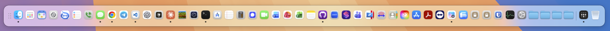
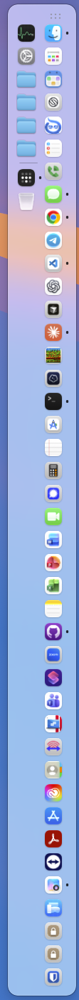
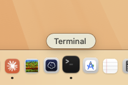
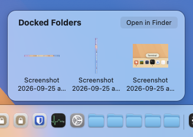
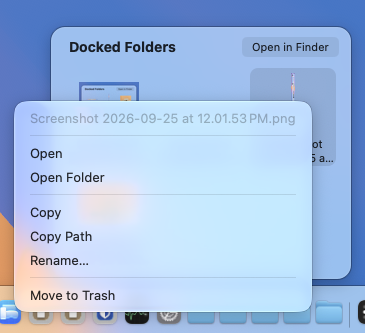
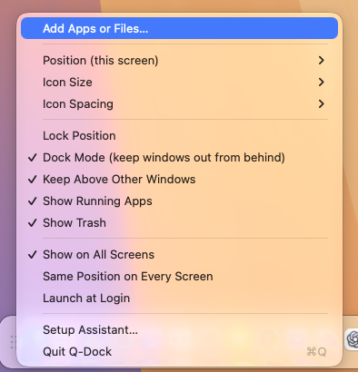
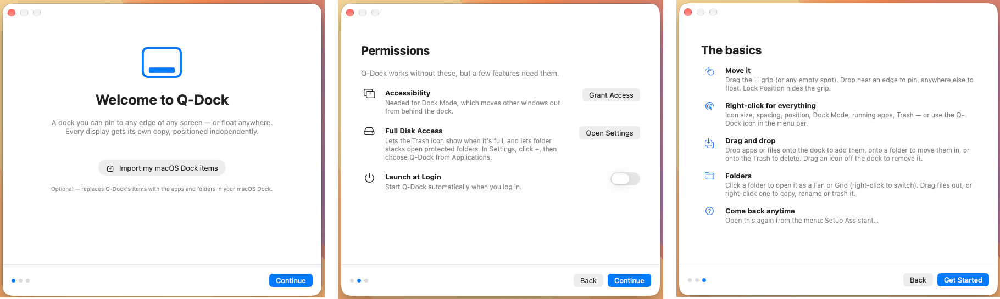

<p align="center">
  
</p>

<h1 align="center">Q-Dock</h1>

<p align="center">
  A floating, pinnable dock for macOS — one on every screen, each positioned on its own.
</p>

<p align="center">
  <a href="https://github.com/cyber-qais/qais-mac-dock/releases/latest"><b>⬇︎ Download the latest release</b></a>
</p>

<p align="center">
  
</p>

---

The macOS Dock lives on one edge of one screen. **Q-Dock** puts a dock on *every* display and lets you
pin each one to any edge, or float it anywhere. It's a single native Swift file with no dependencies.

## Features

| | |
|---|---|
| 🖥️ **Every screen** | A dock on each display. Each one can sit on a different edge, or they can all share one position. |
| 📌 **Pin anywhere** | Snap to the left, right, top or bottom edge, or float it anywhere (vertical or horizontal). |
| 🔒 **Lock Position** | Freeze it in place. The ⋮⋮ grip disappears until you unlock. |
| 🪟 **Dock Mode** | Keeps other windows out from behind an edge-pinned dock by nudging or resizing them. |
| 🏷️ **Instant labels** | App names appear the moment you hover, with a small genie-style magnification. |
| 📂 **Folder stacks** | Open folders as a **Fan** or **Grid**, with previews. Drag files out, drop files in, and right-click to copy, rename or trash. |
| ⚙️ **Running apps** | Open apps that aren't pinned show up after a separator. Drag one in to pin it. |
| 🗑️ **Trash** | Shows empty or full. Drop files on it to trash them, or drop a dock icon on it to remove it. |
| 📏 **Density** | Icon sizes from Tiny to Huge and spacing from Tight to Roomy. Long docks wrap onto more rows. |
| 🧭 **Setup assistant** | A first-launch walkthrough for permissions and the basics. |

## Install

### Download

1. Download **Q-Dock.zip** from the [latest release](https://github.com/cyber-qais/qais-mac-dock/releases/latest) and unzip it.
2. Move **Q-Dock.app** into your Applications folder.
3. Open it. Q-Dock isn't notarized by Apple, so the first time you open it, **right-click → Open**, then click
   **Open** again (or go to System Settings → Privacy & Security → **Open Anyway**). If macOS says the app is
   "damaged", run:

   ```bash
   xattr -dr com.apple.quarantine /Applications/Q-Dock.app
   ```

Runs on macOS 14 or later, on both Apple Silicon and Intel Macs.

### Build from source

Requires macOS 14 or later and Xcode (or the Xcode Command Line Tools).

```bash
git clone https://github.com/cyber-qais/qais-mac-dock.git
cd qais-mac-dock
./build.sh
cp -R Q-Dock.app ~/Applications/
open ~/Applications/Q-Dock.app
```

On first launch, Q-Dock imports the items from your macOS Dock and opens the setup assistant.
The Q-Dock icon in the menu bar opens settings at any time.

### Updating

```bash
git pull && ./build.sh
pkill -x Q-Dock; rm -rf ~/Applications/Q-Dock.app && cp -R Q-Dock.app ~/Applications/ && open ~/Applications/Q-Dock.app
```

> [!NOTE]
> The app is ad-hoc signed when you build it. After each rebuild, macOS treats it as a new app, so you
> need to allow it again under **Accessibility** (and **Full Disk Access**, if you use it).

## Using Q-Dock

### Move and pin it



- **Drag the ⋮⋮ grip** (or any empty spot on the dock).
  - Drop it **within ~60 pt of a screen edge** and it snaps to that edge.
  - Drop it **anywhere else** and it floats there.
- Or right-click the dock → **Position** → *Left / Right / Top / Bottom Edge* or *Floating*.
  A floating dock can be switched between **Vertical** and horizontal.
- **Each screen is independent.** Right-click the dock on a screen to move just that one. To keep
  them in sync, turn on **Same Position on Every Screen**.
- Turn on **Lock Position** once it's where you want it.
- If a dock gets too long for its edge, it wraps onto another row or column (right).

<br clear="right">

<p align="center">
  
</p>
<p align="center"><sub>App names appear the moment you hover.</sub></p>

### Add, arrange and remove

| To… | Do this |
|---|---|
| Add an app, file or folder | Drag it from Finder onto the dock, or use **Add Apps or Files…** |
| Reorder | Drag an icon along the dock |
| Remove | Drag the icon off the dock, or drop it on the Trash, or right-click → **Remove from Dock** |
| Pin a running app | Drag it from the running section into the pinned area, or right-click → **Keep in Dock** |
| Open a file with a specific app | Drop the file onto that app's icon |
| Quit an app | Right-click → **Quit**, or **Force Quit** (no ⌥ needed) |

### Folders: Fan and Grid

Click a docked folder to open it as a stack. Right-click the folder to pick how it opens:

- **Display As** → **Fan**, **Grid**, or **Folder** (open it in Finder)
- **Sort By** → Name, Date Added, Date Modified, Date Created or Kind

<p align="center">
  
  &nbsp;&nbsp;
  
</p>

Inside an open stack:

- **Click** a file to open it.
- **Drag** a file out into Finder, an email or any other app.
- **Right-click** a file for **Open**, **Open Folder**, **Copy**, **Copy Path**, **Rename…** or **Move to Trash**.

To move files **into** a folder, drop them onto its dock icon. Files on the same drive are moved and
files from another drive are copied, as in Finder. Hold **⌥** to always copy. If a name is already
taken, the new file gets a number added (`report 2.pdf`).

### Dock Mode

Turn on **Dock Mode** to keep windows from sitting behind an edge-pinned dock. When a window overlaps the
dock, Q-Dock shrinks it (or moves it if it's small) so it stays clear. It skips full-screen windows and
does nothing for a floating dock.

macOS has no public way for an app to reserve screen space, so Dock Mode uses the Accessibility API and
needs **Accessibility** permission.

## Settings



Everything is in the right-click menu (right) and the menu-bar icon.

<br clear="right">

The defaults are:

| Setting | Default | Options |
|---|---|---|
| Position | Main screen: top edge · other screens: bottom edge | Left, Right, Top, Bottom, Floating |
| Icon Size | Small (32 pt) | Tiny 28 · Small 32 · Medium-Small 40 · Medium 48 · Medium-Large 56 · Large 64 · Huge 80 |
| Icon Spacing | Tight (0) | Tight 0 · Compact 2 · Normal 6 · Roomy 12 |
| Lock Position | On | |
| Dock Mode | On (once Accessibility is allowed) | |
| Keep Above Other Windows | On | |
| Show Running Apps | On | |
| Show Trash | On | |
| Show on All Screens | On | |
| Same Position on Every Screen | Off | |
| Launch at Login | Off | |

### Scripting settings

Settings are stored in the `com.local.qdock` defaults domain, so you can script them. Quit Q-Dock
first, change the settings, then relaunch:

```bash
pkill -x Q-Dock

# Bigger icons with a little breathing room
defaults write com.local.qdock iconSize -float 48
defaults write com.local.qdock spacing -float 6

# Unlock and turn off Dock Mode
defaults write com.local.qdock locked -bool false
defaults write com.local.qdock dockMode -bool false

# Replace the pinned items
defaults write com.local.qdock items -array \
  "/System/Library/CoreServices/Finder.app" \
  "/Applications/Safari.app" \
  "$HOME/Downloads"

open ~/Applications/Q-Dock.app
```

```bash
# See everything
defaults read com.local.qdock

# Start over (re-imports your macOS Dock and shows the setup assistant again)
pkill -x Q-Dock; defaults delete com.local.qdock; open ~/Applications/Q-Dock.app
```

## Permissions

| Permission | Used for | Where to allow it |
|---|---|---|
| Accessibility | Dock Mode (moving other windows) | System Settings → Privacy & Security → Accessibility |
| Full Disk Access | The Trash full/empty icon; opening protected folders as stacks | System Settings → Privacy & Security → Full Disk Access |
| Automation (Finder) | **Empty Trash…** | macOS asks the first time you use it |

The setup assistant opens on first launch, and you can reopen it anytime from **Setup Assistant…** in the menu.
It shows live status for each permission and links to the right Settings page.



## Project layout

```
main.swift               the whole app (AppKit + a SwiftUI setup assistant)
build.sh                 compiles, generates the icon, and bundles Q-Dock.app
tools/make-icon.swift    turns assets/icon.png into AppIcon.icns
assets/icon.png          app icon source
docs/screenshots/        images used in this README
```
